# Decision flows (current implementation)

Every branch in `web_api/` and `workers/` as it is in the code today. Red nodes are errors returned or raised, green nodes are success.
Open the Markdown preview to see the diagrams rendered (needs a Mermaid extension).

- [1. End to end](#1-end-to-end)
- [2. web_api startup and error handling](#2-web_api-startup-and-error-handling)
- [3. Authentication and access](#3-authentication-and-access)
- [4. Users](#4-users)
- [5. Projects and members](#5-projects-and-members)
- [6. Documents (upload / delete)](#6-documents-upload--delete)
- [7. Credentials (provider connections)](#7-credentials-provider-connections)
- [8. Model dropdowns and registered models](#8-model-dropdowns-and-registered-models)
- [9. Project model config](#9-project-model-config)
- [10. Starting a processing job](#10-starting-a-processing-job)
- [11. Internal endpoints (worker to web_api)](#11-internal-endpoints-worker-to-web_api)
- [12. Webhooks and job status](#12-webhooks-and-job-status)
- [13. Extracted content storage](#13-extracted-content-storage)
- [14. Worker task orchestration](#14-worker-task-orchestration)
- [15. Retry rules (worker)](#15-retry-rules-worker)
- [16. Fiction pipeline](#16-fiction-pipeline)
- [17. Academic pipeline](#17-academic-pipeline)
- [18. PDF to Markdown (Marker)](#18-pdf-to-markdown-marker)
- [19. Image captioning](#19-image-captioning)
- [20. Context budget and context notes](#20-context-budget-and-context-notes)
- [21. Chunking](#21-chunking)
- [22. Embeddings and Qdrant storage](#22-embeddings-and-qdrant-storage)
- [23. Webhook sending and temp files](#23-webhook-sending-and-temp-files)

---

## 1. End to end

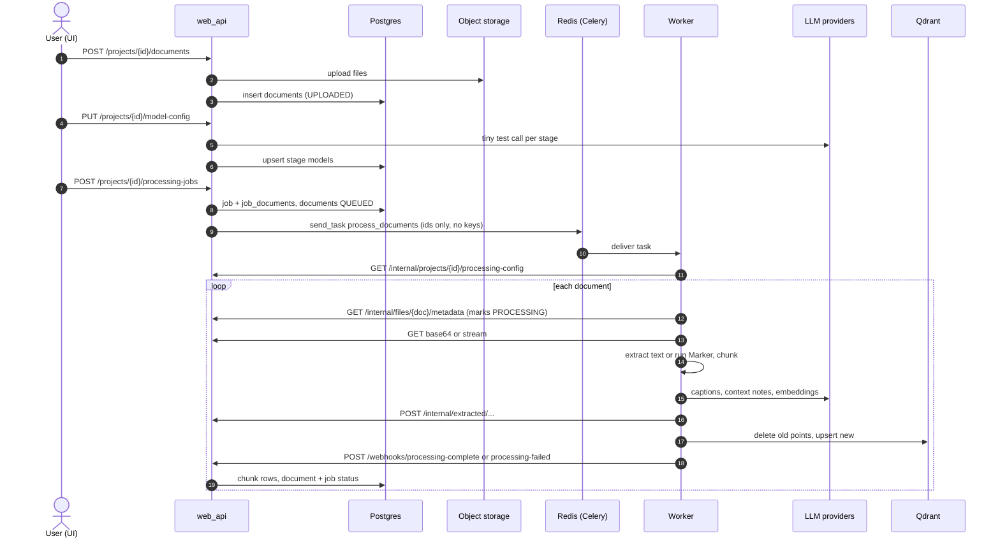
```mermaid
sequenceDiagram
    autonumber
    actor U as User (UI)
    participant API as web_api
    participant PG as Postgres
    participant S3 as Object storage
    participant R as Redis (Celery)
    participant W as Worker
    participant LLM as LLM providers
    participant Q as Qdrant

    U->>API: POST /projects/{id}/documents
    API->>S3: upload files
    API->>PG: insert documents (UPLOADED)
    U->>API: PUT /projects/{id}/model-config
    API->>LLM: tiny test call per stage
    API->>PG: upsert stage models
    U->>API: POST /projects/{id}/processing-jobs
    API->>PG: job + job_documents, documents QUEUED
    API->>R: send_task process_documents (ids only, no keys)
    R->>W: deliver task
    W->>API: GET /internal/projects/{id}/processing-config
    loop each document
        W->>API: GET /internal/files/{doc}/metadata (marks PROCESSING)
        W->>API: GET base64 or stream
        W->>W: extract text or run Marker, chunk
        W->>LLM: captions, context notes, embeddings
        W->>API: POST /internal/extracted/...
        W->>Q: delete old points, upsert new
        W->>API: POST /webhooks/processing-complete or processing-failed
        API->>PG: chunk rows, document + job status
    end
```

---

## 2. web_api startup and error handling

`web_api/main.py`, `web_api/services/MinioService.py`, `web_api/errors.py`

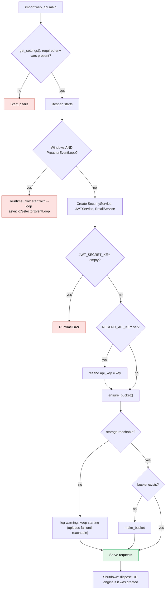
```mermaid
flowchart TD
    classDef err fill:#fde2e1,stroke:#c0392b,color:#000
    classDef ok fill:#e3f6e8,stroke:#27ae60,color:#000

    A["import web_api.main"] --> B{"get_settings(): required env vars present?"}
    B -- no --> X1["Startup fails"]:::err
    B -- yes --> C["lifespan starts"]
    C --> D{"Windows AND ProactorEventLoop?"}
    D -- yes --> X2["RuntimeError: start with --loop asyncio:SelectorEventLoop"]:::err
    D -- no --> E["Create SecurityService, JWTService, EmailService"]
    E --> F{"JWT_SECRET_KEY empty?"}
    F -- yes --> X3["RuntimeError"]:::err
    F -- no --> G{"RESEND_API_KEY set?"}
    G -- yes --> G1["resend.api_key = key"] --> H
    G -- no --> H["ensure_bucket()"]
    H --> I{"storage reachable?"}
    I -- no --> I0["log warning, keep starting (uploads fail until reachable)"] --> K
    I -- yes --> I1{"bucket exists?"}
    I1 -- no --> I2["make_bucket"] --> K
    I1 -- yes --> K["Serve requests"]:::ok
    K --> L["Shutdown: dispose DB engine if it was created"]
```

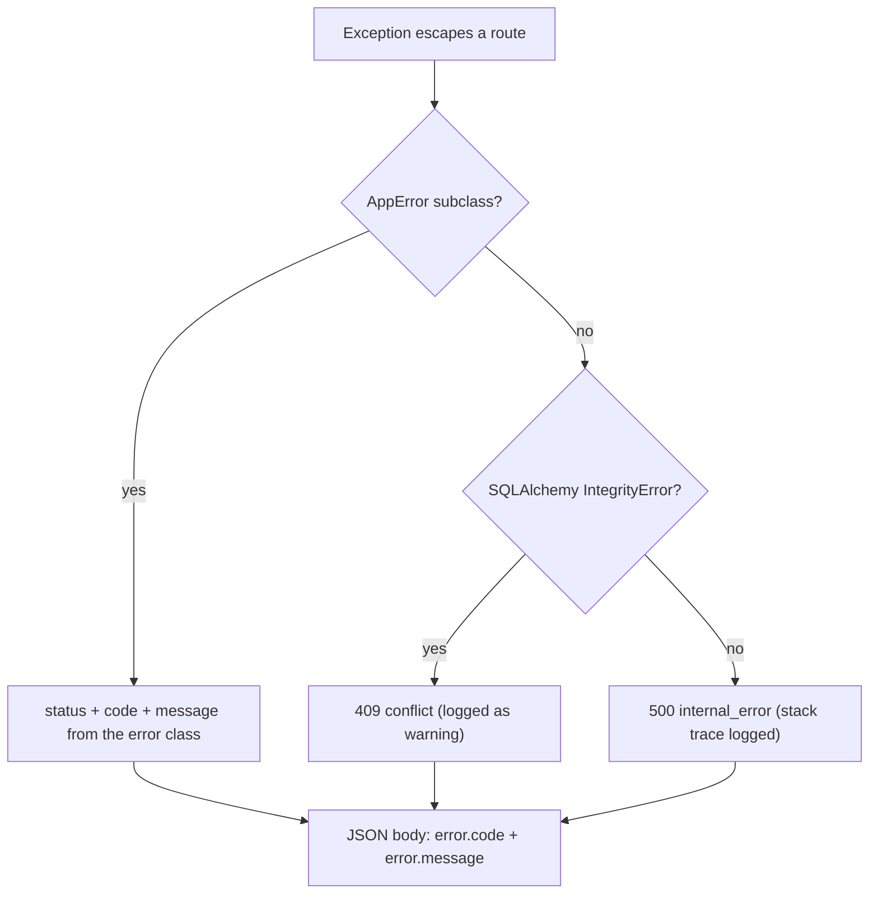
```mermaid
flowchart TD
    A["Exception escapes a route"] --> B{"AppError subclass?"}
    B -- yes --> C["status + code + message from the error class"]
    B -- no --> D{"SQLAlchemy IntegrityError?"}
    D -- yes --> E["409 conflict (logged as warning)"]
    D -- no --> F["500 internal_error (stack trace logged)"]
    C & E & F --> G["JSON body: error.code + error.message"]
```

---

## 3. Authentication and access

`web_api/deps/auth.py`, `web_api/deps/projects.py`, `web_api/deps/internal.py`, `web_api/services/JWTService.py`

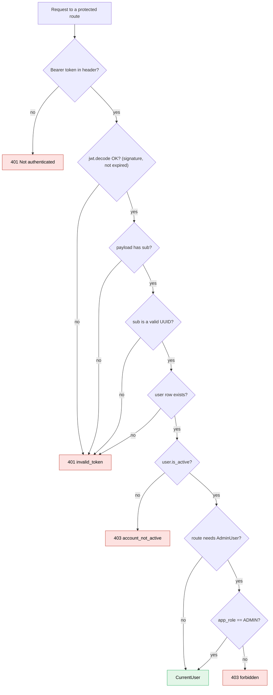
```mermaid
flowchart TD
    classDef err fill:#fde2e1,stroke:#c0392b,color:#000
    classDef ok fill:#e3f6e8,stroke:#27ae60,color:#000

    A["Request to a protected route"] --> B{"Bearer token in header?"}
    B -- no --> X0["401 Not authenticated"]:::err
    B -- yes --> C{"jwt.decode OK? (signature, not expired)"}
    C -- no --> X1["401 invalid_token"]:::err
    C -- yes --> D{"payload has sub?"}
    D -- no --> X1
    D -- yes --> E{"sub is a valid UUID?"}
    E -- no --> X1
    E -- yes --> F{"user row exists?"}
    F -- no --> X1
    F -- yes --> G{"user.is_active?"}
    G -- no --> X2["403 account_not_active"]:::err
    G -- yes --> H{"route needs AdminUser?"}
    H -- no --> OK["CurrentUser"]:::ok
    H -- yes --> I{"app_role == ADMIN?"}
    I -- no --> X3["403 forbidden"]:::err
    I -- yes --> OK
```

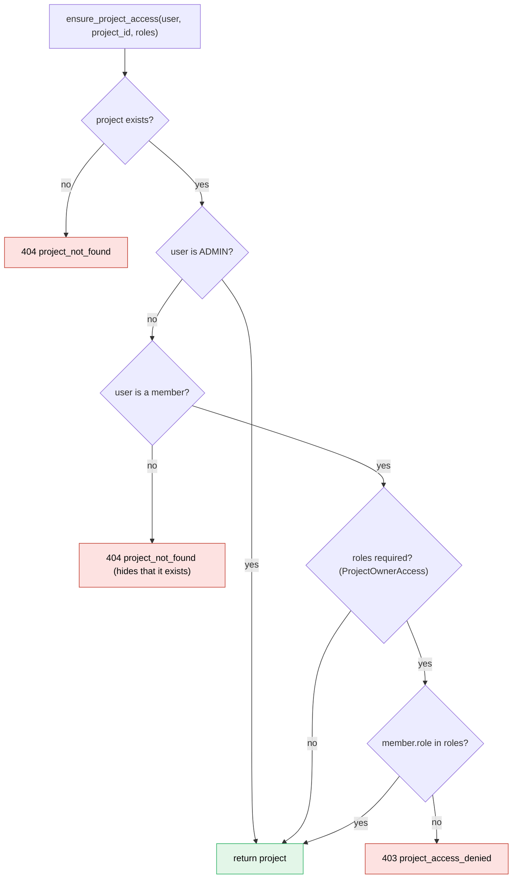
```mermaid
flowchart TD
    classDef err fill:#fde2e1,stroke:#c0392b,color:#000
    classDef ok fill:#e3f6e8,stroke:#27ae60,color:#000

    A["ensure_project_access(user, project_id, roles)"] --> B{"project exists?"}
    B -- no --> X1["404 project_not_found"]:::err
    B -- yes --> C{"user is ADMIN?"}
    C -- yes --> OK["return project"]:::ok
    C -- no --> D{"user is a member?"}
    D -- no --> X2["404 project_not_found (hides that it exists)"]:::err
    D -- yes --> E{"roles required? (ProjectOwnerAccess)"}
    E -- no --> OK
    E -- yes --> F{"member.role in roles?"}
    F -- no --> X3["403 project_access_denied"]:::err
    F -- yes --> OK
```

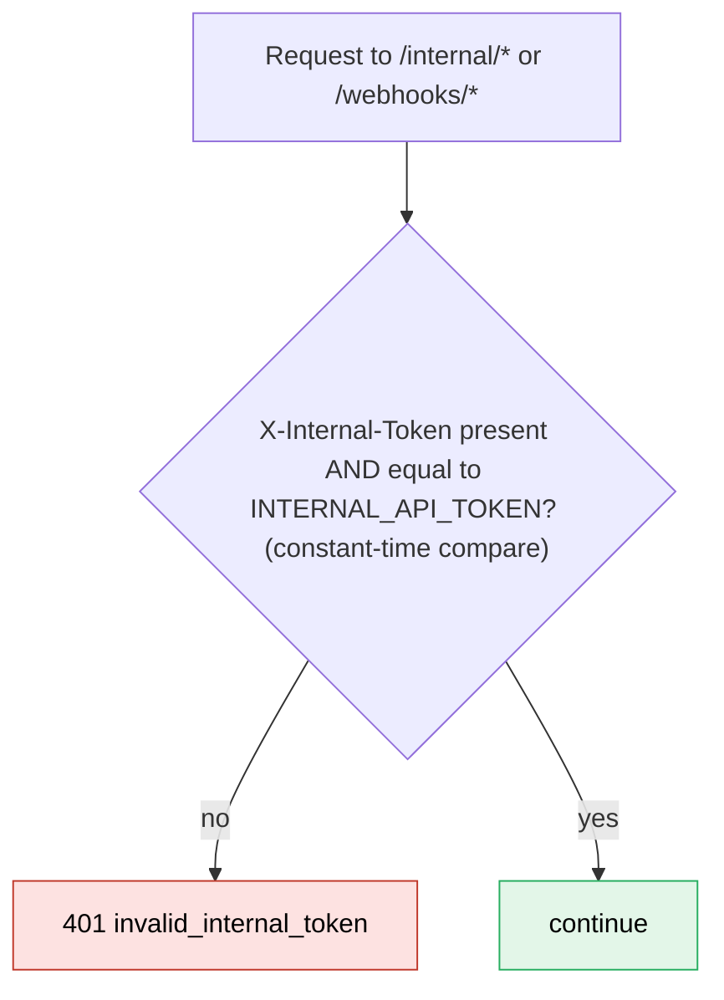
```mermaid
flowchart TD
    classDef err fill:#fde2e1,stroke:#c0392b,color:#000
    classDef ok fill:#e3f6e8,stroke:#27ae60,color:#000

    A["Request to /internal/* or /webhooks/*"] --> B{"X-Internal-Token present AND equal to INTERNAL_API_TOKEN? (constant-time compare)"}
    B -- no --> X["401 invalid_internal_token"]:::err
    B -- yes --> OK["continue"]:::ok
```

Who can call what:

| Guard | Routes |
|---|---|
| Public | `POST /users/setup`, `POST /users/login`, `GET /` |
| Any signed-in user | `POST/GET /projects`, `GET /users/me`, `GET /credentials/schema`, `/credentials/options`, `/credentials/{id}/models` |
| Project member (or admin) | `GET /projects/{id}`, members list, upload/list/get/delete documents, get model config, start/list/get jobs, extractions |
| Project owner (or admin) | update/delete project, add/change/remove members, set/validate model config, remove stage |
| Admin | user management, credential CRUD + test, registered models |
| Internal token | `/internal/*`, `/webhooks/*` |

---

## 4. Users

`web_api/services/AuthService.py`, `web_api/services/EmailService.py`, `web_api/services/SecurityService.py`

### Invite a user (`POST /users`) and resend invite

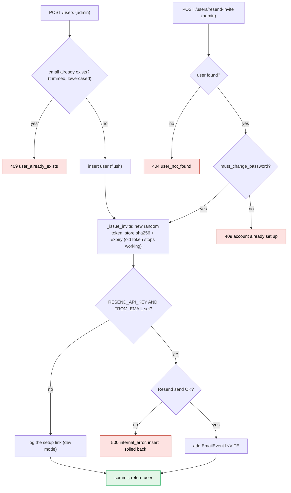
```mermaid
flowchart TD
    classDef err fill:#fde2e1,stroke:#c0392b,color:#000
    classDef ok fill:#e3f6e8,stroke:#27ae60,color:#000

    A["POST /users (admin)"] --> B{"email already exists? (trimmed, lowercased)"}
    B -- yes --> X1["409 user_already_exists"]:::err
    B -- no --> C["insert user (flush)"] --> INV

    R["POST /users/resend-invite (admin)"] --> R1{"user found?"}
    R1 -- no --> X2["404 user_not_found"]:::err
    R1 -- yes --> R2{"must_change_password?"}
    R2 -- no --> X3["409 account already set up"]:::err
    R2 -- yes --> INV

    INV["_issue_invite: new random token, store sha256 + expiry (old token stops working)"] --> E{"RESEND_API_KEY AND FROM_EMAIL set?"}
    E -- no --> E1["log the setup link (dev mode)"] --> DONE
    E -- yes --> G{"Resend send OK?"}
    G -- no --> X4["500 internal_error, insert rolled back"]:::err
    G -- yes --> G1["add EmailEvent INVITE"] --> DONE["commit, return user"]:::ok
```

### Set up account (`POST /users/setup`)

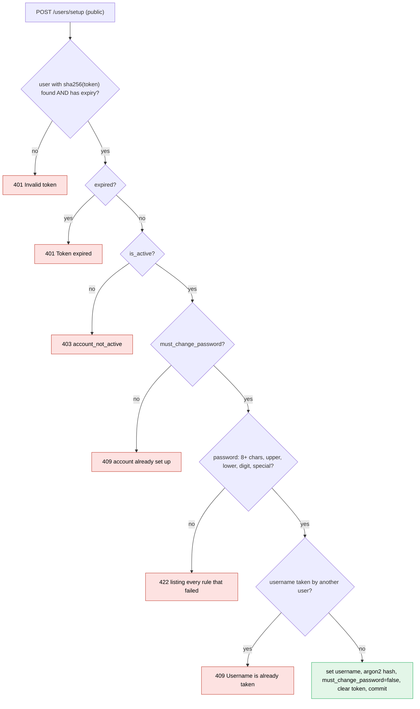
```mermaid
flowchart TD
    classDef err fill:#fde2e1,stroke:#c0392b,color:#000
    classDef ok fill:#e3f6e8,stroke:#27ae60,color:#000

    A["POST /users/setup (public)"] --> B{"user with sha256(token) found AND has expiry?"}
    B -- no --> X1["401 Invalid token"]:::err
    B -- yes --> C{"expired?"}
    C -- yes --> X2["401 Token expired"]:::err
    C -- no --> D{"is_active?"}
    D -- no --> X3["403 account_not_active"]:::err
    D -- yes --> E{"must_change_password?"}
    E -- no --> X4["409 account already set up"]:::err
    E -- yes --> F{"password: 8+ chars, upper, lower, digit, special?"}
    F -- no --> X5["422 listing every rule that failed"]:::err
    F -- yes --> G{"username taken by another user?"}
    G -- yes --> X6["409 Username is already taken"]:::err
    G -- no --> H["set username, argon2 hash, must_change_password=false, clear token, commit"]:::ok
```

### Login and activate / deactivate

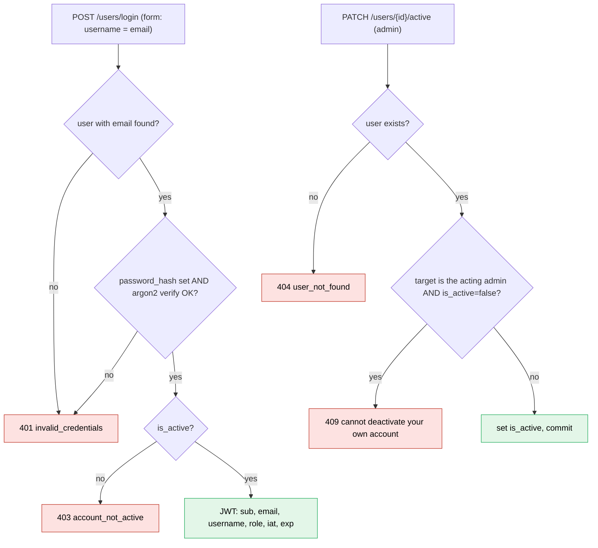
```mermaid
flowchart TD
    classDef err fill:#fde2e1,stroke:#c0392b,color:#000
    classDef ok fill:#e3f6e8,stroke:#27ae60,color:#000

    A["POST /users/login (form: username = email)"] --> B{"user with email found?"}
    B -- no --> X1["401 invalid_credentials"]:::err
    B -- yes --> C{"password_hash set AND argon2 verify OK?"}
    C -- no --> X1
    C -- yes --> D{"is_active?"}
    D -- no --> X2["403 account_not_active"]:::err
    D -- yes --> OK["JWT: sub, email, username, role, iat, exp"]:::ok

    P["PATCH /users/{id}/active (admin)"] --> P1{"user exists?"}
    P1 -- no --> X3["404 user_not_found"]:::err
    P1 -- yes --> P2{"target is the acting admin AND is_active=false?"}
    P2 -- yes --> X4["409 cannot deactivate your own account"]:::err
    P2 -- no --> P3["set is_active, commit"]:::ok
```

---

## 5. Projects and members

`web_api/services/ProjectHandlerService.py`, `web_api/services/ProjectMembersHandlerService.py`, `web_api/routers/ProjectMangerRouter.py`

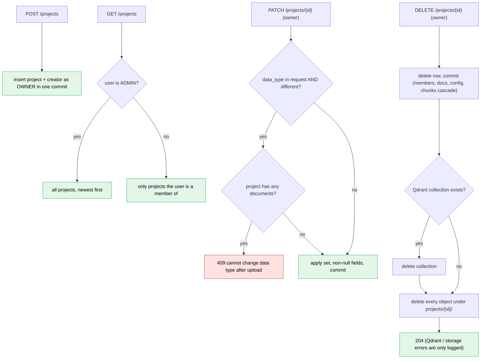
```mermaid
flowchart TD
    classDef err fill:#fde2e1,stroke:#c0392b,color:#000
    classDef ok fill:#e3f6e8,stroke:#27ae60,color:#000

    C["POST /projects"] --> C1["insert project + creator as OWNER in one commit"]:::ok

    L["GET /projects"] --> L1{"user is ADMIN?"}
    L1 -- yes --> L2["all projects, newest first"]:::ok
    L1 -- no --> L3["only projects the user is a member of"]:::ok

    U["PATCH /projects/{id} (owner)"] --> U1{"data_type in request AND different?"}
    U1 -- yes --> U2{"project has any documents?"}
    U2 -- yes --> X1["409 cannot change data type after upload"]:::err
    U2 -- no --> U3
    U1 -- no --> U3["apply set, non-null fields, commit"]:::ok

    D["DELETE /projects/{id} (owner)"] --> D1["delete row, commit (members, docs, config, chunks cascade)"]
    D1 --> D2{"Qdrant collection exists?"}
    D2 -- yes --> D3["delete collection"] --> D4
    D2 -- no --> D4["delete every object under projects/{id}/"]
    D4 --> D5["204 (Qdrant / storage errors are only logged)"]:::ok
```

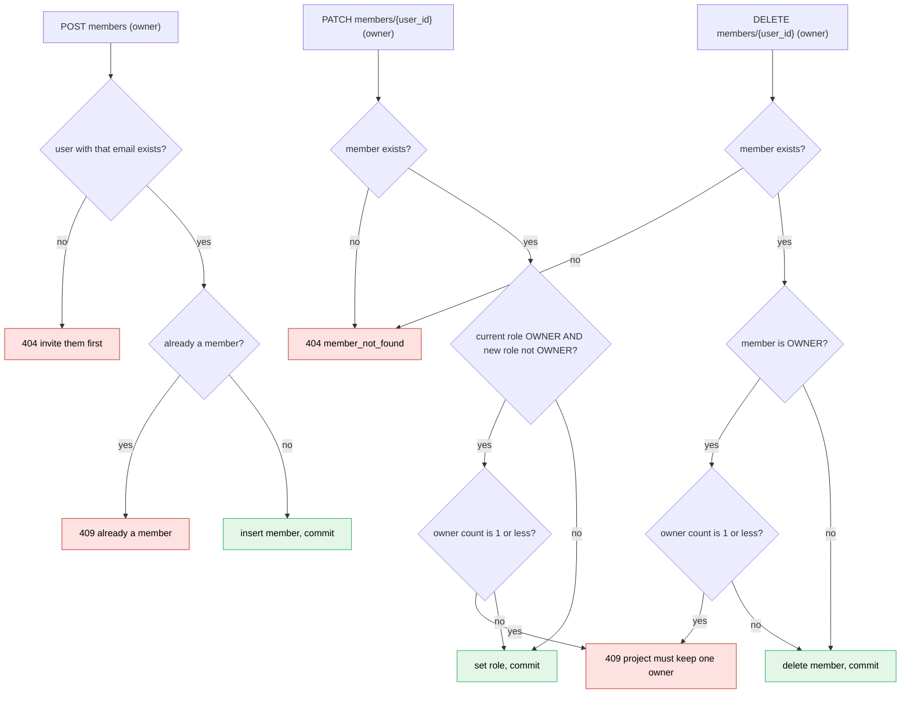
```mermaid
flowchart TD
    classDef err fill:#fde2e1,stroke:#c0392b,color:#000
    classDef ok fill:#e3f6e8,stroke:#27ae60,color:#000

    A["POST members (owner)"] --> A1{"user with that email exists?"}
    A1 -- no --> X1["404 invite them first"]:::err
    A1 -- yes --> A2{"already a member?"}
    A2 -- yes --> X2["409 already a member"]:::err
    A2 -- no --> A3["insert member, commit"]:::ok

    C["PATCH members/{user_id} (owner)"] --> M{"member exists?"}
    R["DELETE members/{user_id} (owner)"] --> M2{"member exists?"}
    M -- no --> X3["404 member_not_found"]:::err
    M2 -- no --> X3
    M -- yes --> C1{"current role OWNER AND new role not OWNER?"}
    C1 -- yes --> LAST{"owner count is 1 or less?"}
    C1 -- no --> C2["set role, commit"]:::ok
    M2 -- yes --> R1{"member is OWNER?"}
    R1 -- yes --> LAST2{"owner count is 1 or less?"}
    R1 -- no --> R2["delete member, commit"]:::ok
    LAST -- yes --> X4["409 project must keep one owner"]:::err
    LAST -- no --> C2
    LAST2 -- yes --> X4
    LAST2 -- no --> R2
```

---

## 6. Documents (upload / delete)

`web_api/services/FileHandlerService.py`, `web_api/routers/FileMangerRouter.py`

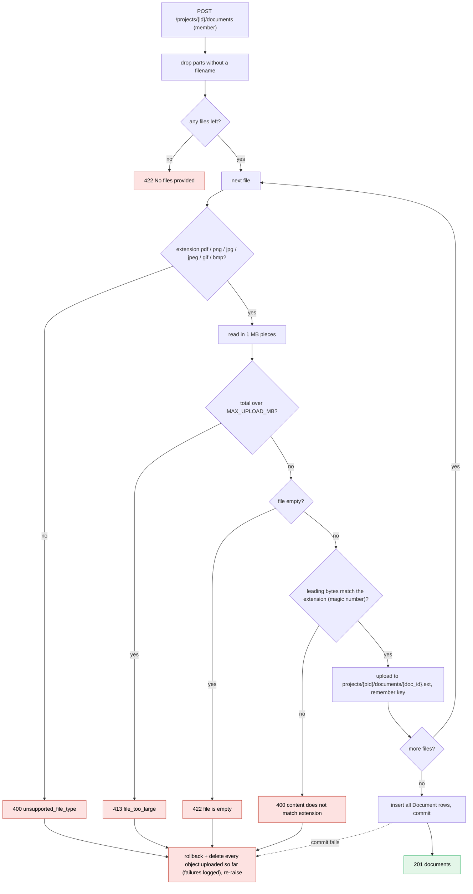
```mermaid
flowchart TD
    classDef err fill:#fde2e1,stroke:#c0392b,color:#000
    classDef ok fill:#e3f6e8,stroke:#27ae60,color:#000

    A["POST /projects/{id}/documents (member)"] --> B["drop parts without a filename"]
    B --> C{"any files left?"}
    C -- no --> X0["422 No files provided"]:::err
    C -- yes --> LOOP["next file"]
    LOOP --> D{"extension pdf / png / jpg / jpeg / gif / bmp?"}
    D -- no --> X1["400 unsupported_file_type"]:::err
    D -- yes --> E["read in 1 MB pieces"]
    E --> F{"total over MAX_UPLOAD_MB?"}
    F -- yes --> X2["413 file_too_large"]:::err
    F -- no --> G{"file empty?"}
    G -- yes --> X3["422 file is empty"]:::err
    G -- no --> H{"leading bytes match the extension (magic number)?"}
    H -- no --> X4["400 content does not match extension"]:::err
    H -- yes --> I["upload to projects/{pid}/documents/{doc_id}.ext, remember key"]
    I --> J{"more files?"}
    J -- yes --> LOOP
    J -- no --> K["insert all Document rows, commit"] --> OK["201 documents"]:::ok
    X1 & X2 & X3 & X4 --> RB["rollback + delete every object uploaded so far (failures logged), re-raise"]:::err
    K -.->|"commit fails"| RB
```

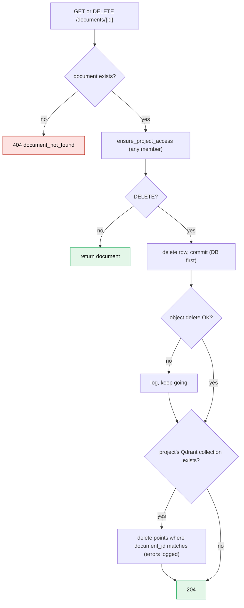
```mermaid
flowchart TD
    classDef err fill:#fde2e1,stroke:#c0392b,color:#000
    classDef ok fill:#e3f6e8,stroke:#27ae60,color:#000

    A["GET or DELETE /documents/{id}"] --> B{"document exists?"}
    B -- no --> X1["404 document_not_found"]:::err
    B -- yes --> C["ensure_project_access (any member)"]
    C --> D{"DELETE?"}
    D -- no --> OK1["return document"]:::ok
    D -- yes --> E["delete row, commit (DB first)"]
    E --> F{"object delete OK?"}
    F -- no --> F1["log, keep going"] --> G
    F -- yes --> G{"project's Qdrant collection exists?"}
    G -- yes --> G1["delete points where document_id matches (errors logged)"] --> OK2
    G -- no --> OK2["204"]:::ok
```

---

## 7. Credentials (provider connections)

`web_api/services/credential_service.py`, `web_api/services/llm_gateway.py`, `web_api/services/providers.py`

### Create / update / delete

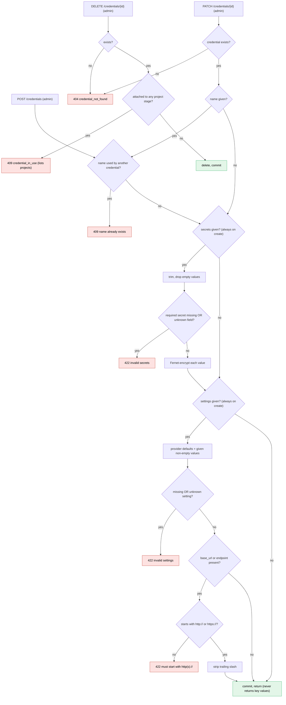
```mermaid
flowchart TD
    classDef err fill:#fde2e1,stroke:#c0392b,color:#000
    classDef ok fill:#e3f6e8,stroke:#27ae60,color:#000

    A["POST /credentials (admin)"] --> N
    U["PATCH /credentials/{id} (admin)"] --> U0{"credential exists?"}
    U0 -- no --> X0["404 credential_not_found"]:::err
    U0 -- yes --> U1{"name given?"}
    U1 -- yes --> N
    U1 -- no --> U2

    N{"name used by another credential?"}
    N -- yes --> X1["409 name already exists"]:::err
    N -- no --> U2{"secrets given? (always on create)"}
    U2 -- yes --> S1["trim, drop empty values"] --> S2{"required secret missing OR unknown field?"}
    S2 -- yes --> X2["422 invalid secrets"]:::err
    S2 -- no --> S3["Fernet-encrypt each value"] --> U3
    U2 -- no --> U3{"settings given? (always on create)"}
    U3 -- yes --> T1["provider defaults + given non-empty values"] --> T2{"missing OR unknown setting?"}
    T2 -- yes --> X3["422 invalid settings"]:::err
    T2 -- no --> T3{"base_url or endpoint present?"}
    T3 -- yes --> T4{"starts with http:// or https://?"}
    T4 -- no --> X4["422 must start with http(s)://"]:::err
    T4 -- yes --> T5["strip trailing slash"] --> SAVE
    T3 -- no --> SAVE
    U3 -- no --> SAVE["commit, return (never returns key values)"]:::ok

    D["DELETE /credentials/{id} (admin)"] --> D1{"exists?"}
    D1 -- no --> X0
    D1 -- yes --> D2{"attached to any project stage?"}
    D2 -- yes --> X5["409 credential_in_use (lists projects)"]:::err
    D2 -- no --> D3["delete, commit"]:::ok
```

### Test connection

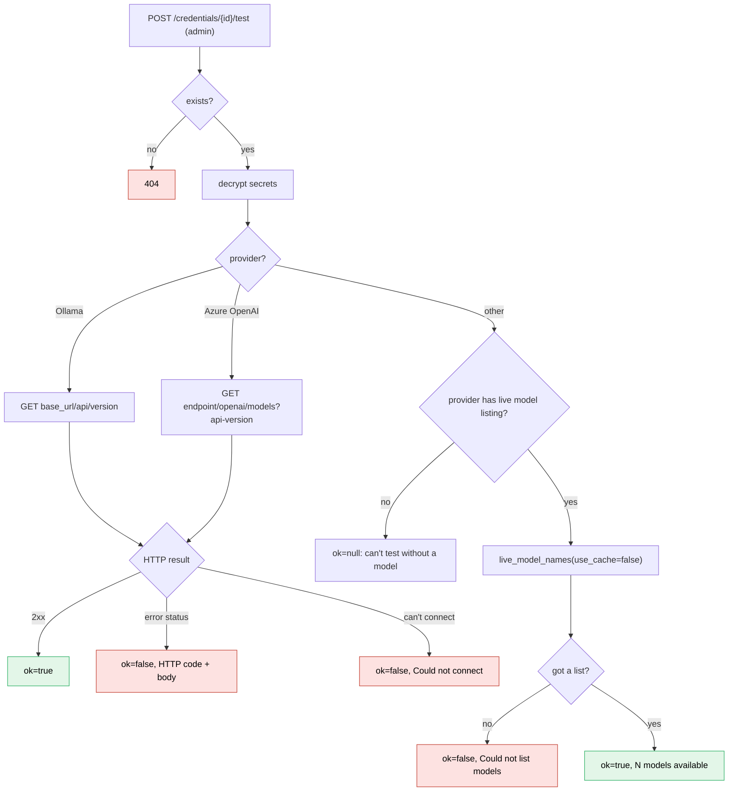
```mermaid
flowchart TD
    classDef err fill:#fde2e1,stroke:#c0392b,color:#000
    classDef ok fill:#e3f6e8,stroke:#27ae60,color:#000

    A["POST /credentials/{id}/test (admin)"] --> B{"exists?"}
    B -- no --> X0["404"]:::err
    B -- yes --> C["decrypt secrets"] --> P{"provider?"}
    P -- Ollama --> O["GET base_url/api/version"]
    P -->|"Azure OpenAI"| Z["GET endpoint/openai/models?api-version"]
    O & Z --> H{"HTTP result"}
    H -->|"2xx"| OK1["ok=true"]:::ok
    H -->|"error status"| F1["ok=false, HTTP code + body"]:::err
    H -->|"can't connect"| F2["ok=false, Could not connect"]:::err
    P -- other --> L{"provider has live model listing?"}
    L -- no --> N["ok=null: can't test without a model"]
    L -- yes --> LM["live_model_names(use_cache=false)"] --> LR{"got a list?"}
    LR -- no --> F3["ok=false, Could not list models"]:::err
    LR -- yes --> OK2["ok=true, N models available"]:::ok
```

### Live model listing (`live_model_names`)

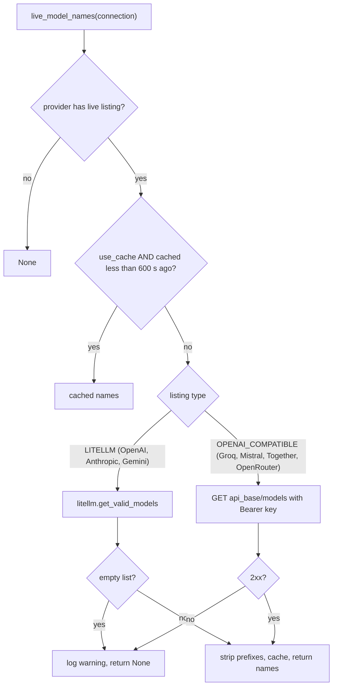
```mermaid
flowchart TD
    A["live_model_names(connection)"] --> B{"provider has live listing?"}
    B -- no --> R0["None"]
    B -- yes --> C{"use_cache AND cached less than 600 s ago?"}
    C -- yes --> R1["cached names"]
    C -- no --> D{"listing type"}
    D -->|"LITELLM (OpenAI, Anthropic, Gemini)"| E["litellm.get_valid_models"] --> E1{"empty list?"}
    E1 -- yes --> FAIL
    E1 -- no --> OK
    D -->|"OPENAI_COMPATIBLE (Groq, Mistral, Together, OpenRouter)"| G["GET api_base/models with Bearer key"] --> G1{"2xx?"}
    G1 -- no --> FAIL["log warning, return None"]
    G1 -- yes --> OK["strip prefixes, cache, return names"]
```

---

## 8. Model dropdowns and registered models

`web_api/services/ModelCatalogService.py`, `web_api/services/llm_gateway.py`

### Model dropdown (`GET /credentials/{id}/models?stage=`)

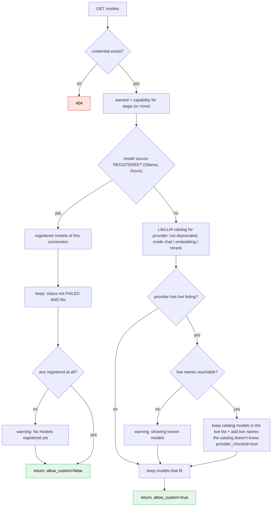
```mermaid
flowchart TD
    classDef err fill:#fde2e1,stroke:#c0392b,color:#000
    classDef ok fill:#e3f6e8,stroke:#27ae60,color:#000

    A["GET models"] --> B{"credential exists?"}
    B -- no --> X0["404"]:::err
    B -- yes --> C["wanted = capability for stage (or none)"]
    C --> D{"model source REGISTERED? (Ollama, Azure)"}
    D -- yes --> E["registered models of this connection"]
    E --> E1["keep: status not FAILED AND fits"]
    E1 --> E2{"any registered at all?"}
    E2 -- no --> E3["warning: No models registered yet"] --> R1
    E2 -- yes --> R1["return, allow_custom=false"]:::ok
    D -- no --> F["LiteLLM catalog for provider: not deprecated, mode chat / embedding / rerank"]
    F --> G{"provider has live listing?"}
    G -- no --> K
    G -- yes --> H{"live names reachable?"}
    H -- no --> H1["warning: showing known models"] --> K
    H -- yes --> H2["keep catalog models in the live list + add live names the catalog doesn't know, provider_checked=true"] --> K
    K["keep models that fit"] --> R2["return, allow_custom=true"]:::ok
```

`fits` = no stage given, **or** capabilities unknown (empty), **or** the wanted capability is in the list.

### Register a model (Ollama / Azure)

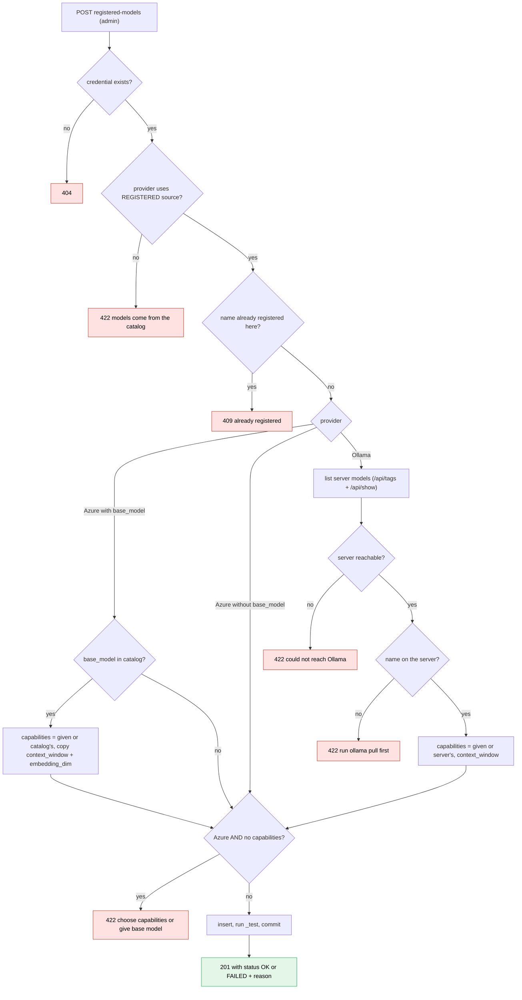
```mermaid
flowchart TD
    classDef err fill:#fde2e1,stroke:#c0392b,color:#000
    classDef ok fill:#e3f6e8,stroke:#27ae60,color:#000

    A["POST registered-models (admin)"] --> B{"credential exists?"}
    B -- no --> X0["404"]:::err
    B -- yes --> C{"provider uses REGISTERED source?"}
    C -- no --> X1["422 models come from the catalog"]:::err
    C -- yes --> D{"name already registered here?"}
    D -- yes --> X2["409 already registered"]:::err
    D -- no --> P{"provider"}
    P -->|"Azure with base_model"| AZ{"base_model in catalog?"}
    AZ -- yes --> AZ1["capabilities = given or catalog's, copy context_window + embedding_dim"] --> Q
    AZ -- no --> Q
    P -->|"Azure without base_model"| Q
    P -- Ollama --> OL["list server models (/api/tags + /api/show)"] --> OL1{"server reachable?"}
    OL1 -- no --> X3["422 could not reach Ollama"]:::err
    OL1 -- yes --> OL2{"name on the server?"}
    OL2 -- no --> X4["422 run ollama pull first"]:::err
    OL2 -- yes --> OL3["capabilities = given or server's, context_window"] --> Q
    Q{"Azure AND no capabilities?"}
    Q -- yes --> X5["422 choose capabilities or give base model"]:::err
    Q -- no --> S["insert, run _test, commit"] --> OK["201 with status OK or FAILED + reason"]:::ok
```

### Testing a registered model (`_test`, never raises)

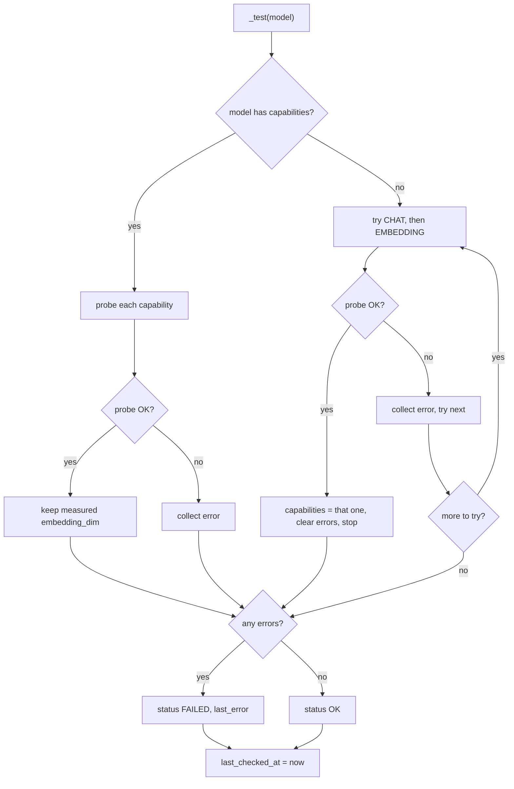
```mermaid
flowchart TD
    A["_test(model)"] --> B{"model has capabilities?"}
    B -- yes --> C["probe each capability"] --> C1{"probe OK?"}
    C1 -- yes --> C2["keep measured embedding_dim"]
    C1 -- no --> C3["collect error"]
    C2 & C3 --> E
    B -- no --> D["try CHAT, then EMBEDDING"] --> D1{"probe OK?"}
    D1 -- yes --> D2["capabilities = that one, clear errors, stop"] --> E
    D1 -- no --> D3["collect error, try next"] --> D4{"more to try?"}
    D4 -- yes --> D
    D4 -- no --> E
    E{"any errors?"}
    E -- yes --> F["status FAILED, last_error"]
    E -- no --> G["status OK"]
    F & G --> H["last_checked_at = now"]
```

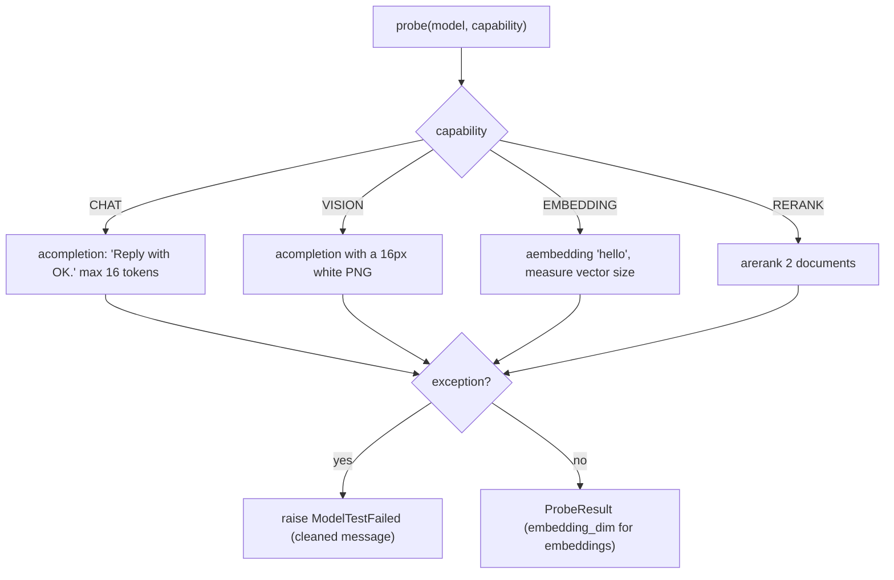
```mermaid
flowchart TD
    A["probe(model, capability)"] --> B{"capability"}
    B -- CHAT --> C["acompletion: 'Reply with OK.' max 16 tokens"]
    B -- VISION --> V["acompletion with a 16px white PNG"]
    B -- EMBEDDING --> E["aembedding 'hello', measure vector size"]
    B -- RERANK --> R["arerank 2 documents"]
    C & V & E & R --> X{"exception?"}
    X -- yes --> F["raise ModelTestFailed (cleaned message)"]
    X -- no --> OK["ProbeResult (embedding_dim for embeddings)"]
```

### Sync Ollama, test one, delete one

```mermaid
flowchart TD
    classDef err fill:#fde2e1,stroke:#c0392b,color:#000
    classDef ok fill:#e3f6e8,stroke:#27ae60,color:#000

    S["POST registered-models/sync?test="] --> S0{"credential exists AND REGISTERED source?"}
    S0 -- no --> X0["404 / 422"]:::err
    S0 -- yes --> S1{"provider is Ollama?"}
    S1 -- no --> X1["422 only for Ollama"]:::err
    S1 -- yes --> S2{"server reachable?"}
    S2 -- no --> X2["422 could not reach Ollama"]:::err
    S2 -- yes --> L["for each model on the server"]
    L --> L1{"already registered?"}
    L1 -- no --> L2["create row (UNTESTED)"] --> L3
    L1 -- yes --> L3{"server reports capabilities?"}
    L3 -- yes --> L4["overwrite capabilities"] --> L5
    L3 -- no --> L5["context_window = server's or keep"]
    L5 --> L6{"FAILED with 'Not found on the Ollama server'?"}
    L6 -- yes --> L7["reset to UNTESTED"]
    L6 -- no --> M
    L7 --> M["registered models no longer on server: FAILED 'Not found on the Ollama server'"]
    M --> T{"test=true?"}
    T -- yes --> T1["_test each server model"] --> C
    T -- no --> C["commit, return list"]:::ok

    TR["POST registered-models/{mid}/test"] --> TR1{"model exists AND belongs to credential?"}
    TR1 -- no --> X3["404 registered_model_not_found"]:::err
    TR1 -- yes --> TR2["_test, commit"]:::ok

    DR["DELETE registered-models/{mid}"] --> DR1{"model exists AND belongs to credential?"}
    DR1 -- no --> X3
    DR1 -- yes --> DR2{"used by any project stage?"}
    DR2 -- yes --> X4["409 model_in_use"]:::err
    DR2 -- no --> DR3["delete, commit"]:::ok
```

---

## 9. Project model config

`web_api/services/ModelConfigService.py`

### Save stages (`PUT /projects/{id}/model-config`)

Any error aborts the whole request; nothing is committed.

```mermaid
flowchart TD
    classDef err fill:#fde2e1,stroke:#c0392b,color:#000
    classDef ok fill:#e3f6e8,stroke:#27ae60,color:#000

    A["PUT model-config (owner)"] --> L["next stage in request"]
    L --> B{"stage EMBEDDER AND project.embedding_locked AND row exists AND credential or model differ?"}
    B -- yes --> X0["409 embedder locked"]:::err
    B -- no --> T1{"credential exists?"}
    T1 -- no --> X1["404 credential_not_found"]:::err
    T1 -- yes --> T2{"model source REGISTERED?"}
    T2 -- yes --> T3{"model registered on that connection?"}
    T3 -- no --> X2["422 add it on the connection page first"]:::err
    T3 -- yes --> T4["known = registered capabilities"] --> T7
    T2 -- no --> T5{"model in LiteLLM catalog?"}
    T5 -- no --> T5b["known = [] (unknown)"] --> T7
    T5 -- yes --> T6{"catalog has no chat / embedding / rerank capability for it?"}
    T6 -- yes --> X3["422 not a chat, embedding or rerank model"]:::err
    T6 -- no --> T6b["known = catalog capabilities"] --> T7
    T7{"known not empty AND stage's capability not in known?"}
    T7 -- yes --> X4["422 can't be used for this stage"]:::err
    T7 -- no --> P["probe with the stage's capability"]
    P --> P1{"probe OK?"}
    P1 -- no --> X5["422 model_test_failed: Stage x"]:::err
    P1 -- yes --> P2{"registered model?"}
    P2 -- yes --> P3["mark registered OK, update embedding_dim"] --> U
    P2 -- no --> U{"stage row exists?"}
    U -- yes --> U1["update credential, model, embedding_dim (embedder only)"] --> N
    U -- no --> U2["insert row"] --> N
    N{"more stages?"}
    N -- yes --> L
    N -- no --> OK["commit, return config"]:::ok
```

### Validate (dry run) and remove a stage

```mermaid
flowchart TD
    classDef err fill:#fde2e1,stroke:#c0392b,color:#000
    classDef ok fill:#e3f6e8,stroke:#27ae60,color:#000

    V["POST model-config/validate (owner)"] --> V1["for each stage: same checks + probe as above"]
    V1 --> V2{"AppError?"}
    V2 -- yes --> V3["result ok=false, error"]
    V2 -- no --> V4["result ok=true, embedding_dim"]
    V3 & V4 --> V5["rollback (nothing saved), all_ok = every result ok"]:::ok

    R["DELETE model-config/{stage} (owner)"] --> R1{"stage EMBEDDER AND embedding_locked?"}
    R1 -- yes --> X["409 embedder locked"]:::err
    R1 -- no --> R2{"row exists?"}
    R2 -- yes --> R3["delete, commit"]:::ok
    R2 -- no --> R4["204, nothing to do"]:::ok
```

---

## 10. Starting a processing job

`web_api/services/ProcessingService.py` (`start_job`)

```mermaid
flowchart TD
    classDef err fill:#fde2e1,stroke:#c0392b,color:#000
    classDef ok fill:#e3f6e8,stroke:#27ae60,color:#000

    A["POST /projects/{id}/processing-jobs (member)"] --> B{"document_ids given?"}
    B -- yes --> C["load those documents in this project"] --> C1{"all ids found in this project?"}
    C1 -- no --> X0["404 not in this project"]:::err
    C1 -- yes --> E
    B -- no --> D["project documents with status UPLOADED or FAILED"] --> E
    E{"any documents?"}
    E -- no --> X1["422 No documents to process"]:::err
    E -- yes --> F{"any QUEUED or PROCESSING?"}
    F -- yes --> X2["409 already queued or processing"]:::err
    F -- no --> G{"any non-PDF?"}
    G -- yes --> X3["422 only PDFs for now"]:::err
    G -- no --> H{"data_type ACADEMIC?"}
    H -- yes --> H1["required: meta_agent, embedder, vision"] --> H3
    H -- no --> H2["required: meta_agent, embedder"] --> H3
    H3{"all required stages configured?"}
    H3 -- no --> X4["422 configure these model steps first"]:::err
    H3 -- yes --> I["create job (celery task id = job id), documents QUEUED + error cleared, job_document rows, commit"]
    I --> J["send_task workers.tasks.process_documents (ids, sizes, data_type, no keys)"]
    J --> J1{"enqueued?"}
    J1 -- no --> K["job FAILED, documents FAILED, job_documents FAILED, commit"] --> X5["409 could not queue (is Redis running?)"]:::err
    J1 -- yes --> OK["202 job"]:::ok
```

---

## 11. Internal endpoints (worker to web_api)

`web_api/routers/InternalRouter.py`, `web_api/services/ProcessingService.py`

### File endpoints

```mermaid
flowchart TD
    classDef err fill:#fde2e1,stroke:#c0392b,color:#000
    classDef ok fill:#e3f6e8,stroke:#27ae60,color:#000

    A["GET /internal/files/{id}/metadata | base64 | stream"] --> B{"document exists?"}
    B -- no --> X0["404 document_not_found"]:::err
    B -- yes --> C{"object stat OK?"}
    C -- no --> X1["404 file missing from storage"]:::err
    C -- yes --> D["should_stream = size at least 5 MB"]
    D --> E{"which endpoint"}
    E -- metadata --> M["mark_started(document)"] --> OK1["metadata"]:::ok
    E -- base64 --> F{"should_stream?"}
    F -- yes --> X2["400 too large, use stream"]:::err
    F -- no --> OK2["file as base64"]:::ok
    E -- stream --> OK3["StreamingResponse, 8 KB pieces"]:::ok
```

```mermaid
flowchart TD
    A["mark_started(document_id)"] --> B{"document exists AND status QUEUED?"}
    B -- no --> R["no-op"]
    B -- yes --> C["document PROCESSING"]
    C --> D["each job_document of it still QUEUED: PROCESSING"]
    D --> E{"its job QUEUED?"}
    E -- yes --> F["job RUNNING, started_at = now"] --> G
    E -- no --> G["commit"]
```

### Processing config (`GET /internal/projects/{id}/processing-config`)

```mermaid
flowchart TD
    classDef err fill:#fde2e1,stroke:#c0392b,color:#000
    classDef ok fill:#e3f6e8,stroke:#27ae60,color:#000

    A["build_worker_config"] --> B{"project exists?"}
    B -- no --> X0["404 project_not_found"]:::err
    B -- yes --> C{"required stages configured? (see section 10)"}
    C -- no --> X1["422 configure these model steps first"]:::err
    C -- yes --> D{"embedder has measured embedding_dim?"}
    D -- no --> X2["422 save the embedder step again"]:::err
    D -- yes --> E["endpoint for meta_agent, embedder, and vision if configured"] --> OK["config: keys, models, dimension, qdrant collection"]:::ok

    E -.-> EP
    subgraph EP["_endpoint(stage row)"]
        E1["decrypt credential, look model up in catalog"] --> E2["context_window = catalog's or none"]
        E2 --> E3{"REGISTERED source?"}
        E3 -- no --> E7
        E3 -- yes --> E4{"registered row found?"}
        E4 -- no --> E7
        E4 -- yes --> E5{"base_model set? (Azure)"}
        E5 -- yes --> E6["catalog info of base_model (fallback: previous)"] --> E6b
        E5 -- no --> E6b["context_window = registered's or catalog's"]
        E6b --> E7{"provider has a chat prefix AND stage is chat or vision?"}
        E7 -- yes --> E8["model = ollama_chat/name"]
        E7 -- no --> E9["model = provider/name"]
    end
```

---

## 12. Webhooks and job status

`web_api/routers/WebhookRouter.py`, `ProcessingService.record_completion`, `_refresh_job_status`

```mermaid
flowchart TD
    classDef err fill:#fde2e1,stroke:#c0392b,color:#000
    classDef ok fill:#e3f6e8,stroke:#27ae60,color:#000

    A["POST /webhooks/processing-complete"] --> A1["succeeded = status is not 'failed'"] --> C
    B["POST /webhooks/processing-failed"] --> B1["succeeded = false, error = '[stage] message'"] --> C
    C{"job, job_document and document all exist?"}
    C -- no --> X0["404 job_not_found"]:::err
    C -- yes --> D["delete the document's old Chunk rows (safe to repeat)"]
    D --> E{"succeeded?"}
    E -- yes --> F["insert Chunk rows (index to Qdrant point id), project.embedding_locked = true"] --> G
    E -- no --> G["job_document + document = COMPLETED or FAILED, processed_at = now"]
    G --> H0{"job.started_at empty?"}
    H0 -- yes --> H0b["started_at = now"] --> H1
    H0 -- no --> H1{"any job_document QUEUED or PROCESSING?"}
    H1 -- yes --> H2["job RUNNING"] --> Z
    H1 -- no --> H3{"all COMPLETED?"}
    H3 -- yes --> H4["job COMPLETED"] --> H7
    H3 -- no --> H5{"all FAILED?"}
    H5 -- yes --> H6["job FAILED"] --> H7
    H5 -- no --> H8["job PARTIAL"] --> H7["finished_at = now"] --> Z
    Z["commit, ack (chunks_created)"]:::ok
```

---

## 13. Extracted content storage

`web_api/services/ExtractionService.py`

```mermaid
flowchart TD
    classDef err fill:#fde2e1,stroke:#c0392b,color:#000
    classDef ok fill:#e3f6e8,stroke:#27ae60,color:#000

    F["POST /internal/extracted/fiction"] --> D1{"document exists AND in that project?"}
    AC["POST /internal/extracted/academic"] --> D2{"document exists AND in that project?"}
    D1 -- no --> X0["404 document_not_found"]:::err
    D2 -- no --> X0
    D1 -- yes --> F1["upload text.txt"] --> UP
    D2 -- yes --> A1["upload text.md + enriched.md"] --> UP
    UP{"extraction row exists?"}
    UP -- no --> UP1["insert"] --> NX
    UP -- yes --> UP2["update fields"] --> NX
    NX{"academic?"}
    NX -- no --> OK["commit, summary"]:::ok
    NX -- yes --> IM["delete old image rows"] --> IL["for each image"]
    IL --> IS{"safe file name? (basename, A-Z a-z 0-9 . _ -, max 200, no leading dot)"}
    IS -- no --> X1["422 invalid image filename"]:::err
    IS -- yes --> IP{"position at least 0?"}
    IP -- yes --> IR["row with position"] --> IN
    IP -- no --> IR2["row with position null"] --> IN
    IN{"more images?"}
    IN -- yes --> IL
    IN -- no --> OK

    UI["POST /internal/extracted/academic/images/{id}"] --> U0{"document exists?"}
    U0 -- no --> X0
    U0 -- yes --> U1["for each image"] --> U2{"safe file name?"}
    U2 -- no --> X1
    U2 -- yes --> U3{"png / jpg / jpeg / gif / svg / webp?"}
    U3 -- no --> X2["400 unsupported image type"]:::err
    U3 -- yes --> U4["upload to extracted/{id}/images/name"]:::ok

    G["GET /documents/{id}/extraction (member)"] --> G1{"extraction exists?"}
    G1 -- no --> X3["404 extraction_not_found"]:::err
    G1 -- yes --> G2["download text"] --> G3{"enriched_key set?"}
    G3 -- yes --> G4["download enriched"] --> G5
    G3 -- no --> G5["return detail"]:::ok
```

---

## 14. Worker task orchestration

`workers/tasks/orchestrator.py`, `workers/services/processing_config.py`

```mermaid
flowchart TD
    classDef err fill:#fde2e1,stroke:#c0392b,color:#000
    classDef ok fill:#e3f6e8,stroke:#27ae60,color:#000

    A["Celery delivers process_documents"] --> A1{"worker event loop missing or closed?"}
    A1 -- yes --> A2["create one loop for the process"] --> B
    A1 -- no --> B{"data_type"}
    B -- fiction --> P1["FictionProcessor"] --> C
    B -- academic --> P2["AcademicProcessor"] --> C
    B -- other --> FA["send processing-failed for every document (stage loading_config)"] --> SUM

    C["GET processing-config (retried, see 15)"] --> C1{"result"}
    C1 -->|"4xx answer"| FA
    C1 -->|"transient error after retries"| RT["self.retry in 60 s x (retries + 1)"]
    RT --> RT1{"retries left? (max 3)"}
    RT1 -- yes --> A
    RT1 -- no --> XF["task fails, no webhook sent: documents stay QUEUED"]:::err
    C1 -->|"other error"| XF
    C1 -- ok --> L["next document"]
    L --> PD["processor.process_document"]
    PD --> PD1{"raised?"}
    PD1 -- yes --> PD2["record failed (processor already sent processing-failed)"] --> N
    PD1 -- no --> PD3["record success"] --> N
    N{"more documents?"}
    N -- yes --> L
    N -- no --> SUM["return summary: total, successful, failed"]:::ok
```

```mermaid
flowchart TD
    classDef err fill:#fde2e1,stroke:#c0392b,color:#000
    classDef ok fill:#e3f6e8,stroke:#27ae60,color:#000

    A["fetch_processing_config"] --> B["GET via retry_async"]
    B --> C{"status 429 or 5xx?"}
    C -- yes --> C1["raise HTTPStatusError (retried, last one propagates)"]:::err
    C -- no --> D{"status 4xx?"}
    D -- yes --> D1{"body has error.message?"}
    D1 -- yes --> D2["ProcessingConfigError(message)"]:::err
    D1 -- no --> D3["ProcessingConfigError(first 300 chars)"]:::err
    D -- no --> E["ProcessingConfig"]:::ok
```

---

## 15. Retry rules (worker)

`workers/utils/retry.py`

```mermaid
flowchart TD
    A["retry_async(fn), attempt n of MAX_RETRIES"] --> B["await fn()"]
    B --> C{"raised?"}
    C -- no --> OK["return result"]
    C -- yes --> D{"last attempt OR not retryable?"}
    D -- yes --> X["raise"]
    D -- no --> E["sleep RETRY_BACKOFF_BASE ^ n + 0-1 s jitter"] --> A
```

```mermaid
flowchart TD
    E["is_transient(error)"] --> A{"httpx.HTTPStatusError?"}
    A -- yes --> S["retry if status 429 or 5xx"]
    A -- no --> B{"httpx.TransportError? (timeout, refused)"}
    B -- yes --> T["retry"]
    B -- no --> C{"LiteLLM RateLimit / APIConnection / ServiceUnavailable / InternalServer / BadGateway?"}
    C -- yes --> T
    C -- no --> D{"LiteLLM Authentication / PermissionDenied / NotFound / BadRequest / UnprocessableEntity?"}
    D -- yes --> F["don't retry"]
    D -- no --> G{"other litellm.APIError?"}
    G -- yes --> S
    G -- no --> H{"Qdrant UnexpectedResponse?"}
    H -- yes --> S
    H -- no --> I{"Qdrant ResponseHandlingException? (unreachable)"}
    I -- yes --> T
    I -- no --> F
```

---

## 16. Fiction pipeline

`workers/tasks/fiction_processor.py`

Any exception in steps 1 to 9 sends `processing-failed` with the stage it was in, keeps the temp files, and re-raises.

```mermaid
flowchart TD
    classDef err fill:#fde2e1,stroke:#c0392b,color:#000
    classDef ok fill:#e3f6e8,stroke:#27ae60,color:#000

    A["process_document"] --> S1["1 FETCHING_FILES: fetch_file"]
    S1 --> F0["GET metadata (retried), marks PROCESSING"] --> F1{"should_stream? (at least 5 MB)"}
    F1 -- yes --> F2["GET stream, write 8 KB pieces, 300 s timeout (retried)"] --> S2
    F1 -- no --> F3["GET base64, decode, write, 60 s timeout (retried)"] --> S2
    S2["2 EXTRACTING_TEXT: PyMuPDF in a thread"] --> S2a{"text blank?"}
    S2a -- yes --> XE["ValueError: extracted text is empty"]:::err
    S2a -- no --> S3["3 STORING_EXTRACTED_CONTENT: page count, POST /internal/extracted/fiction (retried)"]
    S3 --> S3a{"store failed?"}
    S3a -- yes --> S3b["log error, keep going"] --> S4
    S3a -- no --> S4["4 CHUNKING: plan_context_budget(llm context window), parents + children (see 20, 21)"]
    S4 --> S5["5 CONTEXTUALIZING: context note per child (see 20)"]
    S5 --> S6["6 GENERATING_EMBEDDINGS (see 22)"]
    S6 --> S7["7 GENERATING_BM25: BM25 documents of combined text"]
    S7 --> S8["8 STORING_VECTORS: Qdrant (see 22)"]
    S8 --> S9["9 NOTIFYING_COMPLETION: processing-complete webhook (never raises)"]
    S9 --> S10["10 delete task temp folder"] --> OK["return counts"]:::ok
    XE --> FAIL["processing-failed webhook (stage), keep temp files, re-raise"]:::err
```

---

## 17. Academic pipeline

`workers/tasks/academic_processor.py`

```mermaid
flowchart TD
    classDef err fill:#fde2e1,stroke:#c0392b,color:#000
    classDef ok fill:#e3f6e8,stroke:#27ae60,color:#000

    A["process_document"] --> V{"config.vision is None?"}
    V -- yes --> XV["ValueError (raised before the try: no processing-failed webhook)"]:::err
    V -- no --> S1["1 FETCHING_FILES: fetch_file (same as fiction)"]
    S1 --> S2["2 PDF_TO_MARKDOWN: Marker child process (see 18)"]
    S2 --> I{"Marker produced images?"}
    I -- yes --> S3["3 IMAGE_CAPTIONING: parse markdown, caption each image (see 19)"] --> S4
    I -- no --> S3b["descriptions = none"] --> S4
    S4["4 IMAGE_REPLACEMENT: each image link becomes bold IMAGE label + description"] --> S4a{"description for this file?"}
    S4a -- no --> S4b["use '[Image: filename]'"] --> S5
    S4a -- yes --> S5
    S5["5 STORING_EXTRACTED_CONTENT"] --> S5a{"images?"}
    S5a -- yes --> S5b{"any image files exist on disk?"}
    S5b -- no --> S5c["skip upload (warn)"] --> S5d
    S5b -- yes --> S5e["upload images (retried)"] --> S5d
    S5a -- no --> S5d["POST /internal/extracted/academic (retried)"]
    S5d --> S5f{"any storage step failed?"}
    S5f -- yes --> S5g["log error, keep going"] --> S6
    S5f -- no --> S6["6 CHUNKING: budget with ACADEMIC_CHILD_CHUNK_SIZE, AcademicChunkingService (see 21)"]
    S6 --> S7["7 CONTEXTUALIZING"] --> S8["8 GENERATING_EMBEDDINGS"] --> S9["9 GENERATING_BM25"] --> S10["10 STORING_VECTORS"]
    S10 --> S11["11 NOTIFYING_COMPLETION"] --> S12["delete task temp folder"] --> OK["return counts + chunker metadata"]:::ok
    S1 & S2 & S3 & S4 & S6 & S7 & S8 & S9 & S10 -.->|"exception"| FAIL["processing-failed webhook (stage), re-raise"]:::err
```

---

## 18. PDF to Markdown (Marker)

`workers/services/pdf_to_markdown.py`, `workers/services/marker_runner.py`

```mermaid
flowchart TD
    A["build_run"] --> B["config: pdf, output dir, format, force_ocr"]
    B --> B1{"MARKER_MODE set?"}
    B1 -- yes --> B2["add mode"] --> C
    B1 -- no --> C{"MARKER_USE_LLM?"}
    C -- no --> NOLLM["run without LLM"]
    C -- yes --> D{"project vision model given?"}
    D -- yes --> P{"provider prefix of vision model"}
    P -- gemini --> S1["GoogleGeminiService (+ GOOGLE_API_KEY in child env)"]
    P -- openai --> S2["OpenAIService (+ base_url if set)"]
    P -- anthropic --> S3["ClaudeService"]
    P -- azure --> S4["AzureOpenAIService"]
    P -->|"ollama / ollama_chat"| S5["OllamaService (default 127.0.0.1:11434)"]
    P -- openrouter --> S6["OpenRouterService"]
    P -- other --> W["warn: Marker has no service"] --> G
    D -- no --> G{"GEMINI_API_KEY in worker env?"}
    G -- yes --> S7["GoogleGeminiService with that key"]
    G -- no --> NOLLM2["warn, run without LLM"]
    S1 & S2 & S3 & S4 & S5 & S6 & S7 --> U["use_llm, llm_service, redo_inline_math, non-empty options"]
```

```mermaid
flowchart TD
    classDef err fill:#fde2e1,stroke:#c0392b,color:#000
    classDef ok fill:#e3f6e8,stroke:#27ae60,color:#000

    A["_run_marker"] --> B["child env = worker env minus provider key vars + service env + MARKER_RUNNER_CONFIG json"]
    B --> C["spawn marker_runner.py (new session on Linux/macOS)"]
    C --> D{"done within MARKER_TIMEOUT?"}
    D -- no --> K{"Windows?"}
    K -- yes --> K1["taskkill /T /F"] --> XT
    K -- no --> K2["killpg SIGKILL"] --> XT["TimeoutError"]:::err
    D -- yes --> E{"exit code 0?"}
    E -- no --> XR["RuntimeError with stderr tail"]:::err
    E -- yes --> F{"output/stem.md exists?"}
    F -- yes --> M
    F -- no --> F2{"output/stem/stem.md exists?"}
    F2 -- yes --> M
    F2 -- no --> F3{"any .md under output?"}
    F3 -- yes --> F4["use first one (warn)"] --> M
    F3 -- no --> XF["FileNotFoundError"]:::err
    M["read markdown, collect .png .jpg .jpeg .gif .svg files"] --> OK["MarkdownOutput"]:::ok
```

---

## 19. Image captioning

`workers/services/vision_service.py`

A failed caption never fails the document.

```mermaid
flowchart TD
    A["caption_images_with_context"] --> B["map markdown image links by file name"]
    B --> C["for each image, concurrently (limit LLM_MAX_CONCURRENT_CALLS)"]
    C --> D{"image linked in the markdown?"}
    D -- yes --> E["context = VISION_CONTEXT_WINDOW chars before + after, with IMAGE POSITION marker"] --> F["prompt with context"]
    D -- no --> G["generic figure prompt"]
    F & G --> H["acompletion with base64 image (transient errors retried)"]
    H --> I{"succeeded?"}
    I -- yes --> J["caption text"]
    I -- no --> K["'[Image: name - caption failed: error]'"]
```

---

## 20. Context budget and context notes

`workers/services/contextualizer.py`

```mermaid
flowchart TD
    classDef err fill:#fde2e1,stroke:#c0392b,color:#000
    classDef ok fill:#e3f6e8,stroke:#27ae60,color:#000

    A["plan_context_budget(context_window, child_tokens)"] --> B{"context window known?"}
    B -- no --> D0["defaults: PARENT_CHUNK_SIZE, PARENT_CHUNK_OVERLAP, LLM_MAX_CHUNKS_PER_BATCH"]:::ok
    B -- yes --> C["usable = window * 0.85 - 1500, per_child = child + max note, min_parent = 4 * child"]
    C --> E{"usable - batch * per_child below min_parent?"}
    E -- yes --> E1["batch = max(1, (usable - min_parent) / per_child)"] --> F
    E -- no --> F["room = usable - batch * per_child"]
    F --> G{"room below child_tokens?"}
    G -- yes --> X["ValueError: context window too small"]:::err
    G -- no --> H["parent = min(default, room), overlap = min(default, parent / 6)"]:::ok
```

```mermaid
flowchart TD
    classDef err fill:#fde2e1,stroke:#c0392b,color:#000
    classDef ok fill:#e3f6e8,stroke:#27ae60,color:#000

    I["Contextualizer init"] --> I1{"model is ollama/ or ollama_chat/ AND budget given?"}
    I1 -- yes --> I2["num_ctx = call_tokens, capped at context window if known"] --> A
    I1 -- no --> A

    A["contextualize_hierarchical"] --> B["each parent's children split into batches of batch_size"]
    B --> C["run all batches concurrently (limit LLM_MAX_CONCURRENT_CALLS)"]
    C --> BT

    subgraph BT["one batch, up to 3 attempts"]
        P["prompt: title + whole parent + numbered chunks"] --> J{"model supports JSON schema?"}
        J -- yes --> J1["response_format = ContextualOutput"] --> L
        J -- no --> L["acompletion, max_tokens sized for every note"]
        L --> M{"JSON object in reply?"}
        M -- no --> ERR
        M -- yes --> N{"note count == chunk count?"}
        N -- no --> ERR
        N -- yes --> OKB["notes + combined text"]
        L -.->|"API error"| ERR{"permanent API error? (auth, not found, bad request, other 4xx)"}
        ERR -- yes --> XB["raise"]
        ERR -- no --> R{"attempts left?"}
        R -- yes --> R1["sleep 2 ^ attempt"] --> P
        R -- no --> XB
    end

    BT --> D{"any batch failed?"}
    D -- yes --> X1["RuntimeError: document fails"]:::err
    D -- no --> E{"notes total == children total?"}
    E -- no --> X2["RuntimeError"]:::err
    E -- yes --> OK["chunks sorted by index"]:::ok
```

---

## 21. Chunking

`workers/services/chunking_service_fiction.py`, `workers/services/chunking_service_academic.py`, `workers/services/chunk_assignment.py`

```mermaid
flowchart TD
    F["Fiction: create_hierarchical_chunks(text)"] --> F1["parents: SentenceChunker(parent size, overlap)"]
    F1 --> F2["children: SentenceChunker(child size, overlap) over the WHOLE text"]
    F2 --> AS["assign_children_to_parents"]

    A["Academic: create_hierarchical_chunks(enriched markdown)"] --> A1["MarkdownChef: tables + code blocks, regex: block math"]
    A1 --> A2["parents: SentenceChunker"]
    A2 --> A3["split whole document at every component start/end"]
    A3 --> A4{"span starts at a component?"}
    A4 -- yes --> A5["segment of that component's type"]
    A4 -- no --> A6["text segment"]
    A5 & A6 --> S["for each segment"]
    S --> S0{"blank?"}
    S0 -- yes --> S
    S0 -- no --> T{"type"}
    T -- text --> T1["SentenceChunker(child size, no overlap)"]
    T -- table --> T2["TableChunker(max rows)"]
    T -- code --> T3["CodeChunker(language, default python)"]
    T -- block_math --> T4["one chunk, never split"]
    T1 & T2 & T3 & T4 --> T5["children with positions from document start"] --> AS
```

```mermaid
flowchart TD
    classDef err fill:#fde2e1,stroke:#c0392b,color:#000

    A["assign_children_to_parents"] --> B{"any parents?"}
    B -- no --> X["ValueError"]:::err
    B -- yes --> C["for each child"]
    C --> D{"fully inside one or more parents?"}
    D -- yes --> E["parent whose middle is closest to the child's middle"]
    D -- no --> F["parent that overlaps it most"]
    E & F --> G["set parent_context_id, add to parent.child_indices"]
```

---

## 22. Embeddings and Qdrant storage

`workers/services/embedding_service.py`, `workers/services/storage_service.py`

```mermaid
flowchart TD
    classDef err fill:#fde2e1,stroke:#c0392b,color:#000
    classDef ok fill:#e3f6e8,stroke:#27ae60,color:#000

    A["generate_embeddings"] --> B["batches of EMBEDDING_BATCH_SIZE"]
    B --> C["aembedding (transient errors retried), sort by index"]
    C --> D{"vector size == project's measured dimension?"}
    D -- no --> X["ValueError: save the embedder step again"]:::err
    D -- yes --> E{"more batches?"}
    E -- yes --> B
    E -- no --> OK["vectors"]:::ok
```

```mermaid
flowchart TD
    classDef err fill:#fde2e1,stroke:#c0392b,color:#000
    classDef ok fill:#e3f6e8,stroke:#27ae60,color:#000

    A["store_chunks"] --> B{"chunks, dense and sparse counts equal?"}
    B -- no --> X0["ValueError mismatched lengths"]:::err
    B -- yes --> C{"collection exists?"}
    C -- yes --> C1{"dense size == embedder dimension?"}
    C1 -- no --> X1["ValueError: collection holds other size"]:::err
    C1 -- yes --> D
    C -- no --> V{"Qdrant version at least 1.15.2?"}
    V -- no --> X2["RuntimeError: Qdrant too old for BM25"]:::err
    V -- yes --> V1["create collection: dense cosine + sparse IDF, keyword index on document_id"] --> D
    D{"collection exists? (delete step)"}
    D -- yes --> D1["delete the document's old points"] --> E
    D -- no --> E["points with id uuid5(document_id:chunk_index)"]
    E --> F["upsert in QDRANT_UPSERT_BATCH_SIZE batches (each retried)"] --> OK["point ids"]:::ok
```

Every Qdrant call runs in a thread through `retry_async`.

---

## 23. Webhook sending and temp files

`workers/utils/webhook_notifier.py`, `workers/utils/temp_file_manager.py`, `workers/celery_app.py`

```mermaid
flowchart TD
    A["notify_processing_complete / notify_processing_failed"] --> B["POST with internal token (transient errors retried)"]
    B --> C{"succeeded?"}
    C -- yes --> D["return response"]
    C -- no --> E["log error, return None (never raises)"]
```

```mermaid
flowchart TD
    W["worker_ready signal"] --> W1["for each folder in TEMP_FILE_DIR"]
    W1 --> W2{"older than TEMP_FILE_RETENTION_HOURS?"}
    W2 -- yes --> W3["delete (errors logged)"]
    W2 -- no --> W1

    T["cleanup_task_directory(task_id, force)"] --> T1{"folder exists?"}
    T1 -- no --> T0["return"]
    T1 -- yes --> T2{"force?"}
    T2 -- yes --> T3["delete"]
    T2 -- no --> T4{"older than retention?"}
    T4 -- yes --> T3
    T4 -- no --> T0
```
